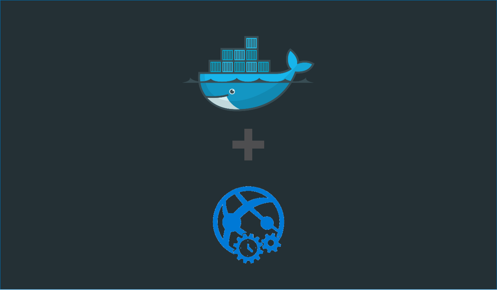

### What is WebJobs SDK?

The Azure WebJobs SDK is a framework that simplifies the task of writing background processing code that runs in Azure WebJobs. It includes a declarative binding and trigger system that works with Azure Storage Blobs, Queues and Tables as well as Service Bus. The binding system makes it incredibly easy to write code that reads or writes Azure Storage objects. The trigger system automatically invokes a function in your code whenever any new data is received in a queue or blob.

The version 3.x of the WebJobs SDK supports both .NET Core and .NET Framework console apps. This opens all sorts of possibilities of hosting it apart from App Service. In this article I'll walk you through process of hosting the Web Job on Docker.

### Create Web job using Web Job SDK 3

Let's create simple queue triggered web job which will print the message received in the azure queue.

1. open a command prompt and enter the below command.

```bash
dotnet new console -o "ContainerizedWebJob"
cd ContainerizedWebJob
```

2. Install the latest stable 3.x versions of the following NuGet packages.
    - Microsoft.Azure.WebJobs
    - Microsoft.Azure.WebJobs.Extensions

Here are the commands:

```bash
dotnet add package Microsoft.Azure.WebJobs --version 3.0.11
dotnet add package Microsoft.Azure.WebJobs.Extensions --version 3.0.2
```

3. We will need console logging using which we will print the recieved message from the queue on the console. Install the latest version of belo packages

```bash
dotnet add package Microsoft.Extensions.Logging --version 2.2.0
dotnet add package Microsoft.Extensions.Logging.Console --version 2.2.0
```

4. Install storage binding extension Starting with version 3.x, you must explicitly install the Storage binding extension required by the WebJobs SDK. In prior versions, the Storage bindings were included in the SDK. Install latest version of below package

```bash
dotnet add package Microsoft.Azure.WebJobs.Extensions.Storage --version 3.0.7
```

5. Now we will create the host and configure it.Add program.cs file and replace the content of with below.

```csharp
using Microsoft.Extensions.Hosting;
using Microsoft.Extensions.Logging;

namespace ContainerizedWebJob
{
    class Program
    {
        static void Main(string[] args)
        {
            var builder = new HostBuilder();
            builder.UseEnvironment(EnvironmentName.Development);
            builder.ConfigureWebJobs(b =>
            {
                b.AddAzureStorageCoreServices();
                b.AddAzureStorage();
            });
            builder.ConfigureLogging((context, b) =>
            {
                b.AddConsole();


            });
            var host = builder.Build();
            using (host)
            {
                host.Run();
            }
        }
    }
}
```

Add `Functions.cs` file which will have the functions which will process the queue message.

```csharp
using Microsoft.Azure.WebJobs;
using Microsoft.Extensions.Logging;
namespace ContainerizedWebJob
{
    public class Functions
    {
        public static void ProcessQueueMessage(
            [QueueTrigger("message-queue")] string message,
            ILogger logger)
        {
            logger.LogInformation(message);
        }
    }
}
```
Add appsettings.json

```json
{
  "AzureWebJobsStorage": "UseDevelopmentStorage=true"
}
```

6. Modify `ContainerizedWebJob.csproj` and add new `<ItemGroup>`.

```xml
<ItemGroup>
  <None Update="appsettings.json">
    <CopyToOutputDirectory>Always</CopyToOutputDirectory>
  </None>
</ItemGroup>
```

7. Lets run an test it.

```bash
dotnet build
dotnet run
```

Create a queue named `message-queue` add the message.


### Deploy Web job on docker.

To deploy this application on docker we need to specify docker configuration. Add `Dockerfile` at the root of the application.

```Dockerfile
FROM mcr.microsoft.com/dotnet/core/runtime:2.2
WORKDIR /app
COPY ./bin/Debug/netcoreapp2.2/publish .
ENTRYPOINT [ "dotnet", "ContainerizedWebJob.dll" ]
```

Before we deploy this app on docker we need to make changes to our `appsettings.json` file as below.

```json
{
  "AzureWebJobsStorage": "UseDevelopmentStorage=true;DevelopmentStorageProxyUri=http://host.docker.internal"
}
```

**Note:** The **Azure Storage Emulator** is bound in a local-only network configuration and **Docker** for Windows runs in a **VM** using **Hyper-V**. Hence to access the emulator running on host (Windows) we need to use the proxy `http://host.docker.internal` instead of `http://127.0.0.1`.

Now that we are done with all the configuration we shall create and run the docker image. To create a docker image, run the below command where you have put the `Dockerfile`.

```bash
docker build -t containerized-web-job
```

Once the image is create we shall run it using below command.

```bash
docker run -it --rm containerized-web-job
```

**Note:** above command will delete the container as soon as we stop the web job.

You can find source code <a href="https://github.com/KoditkarVedant/containerized-web-job" target="_blank">here</a>.